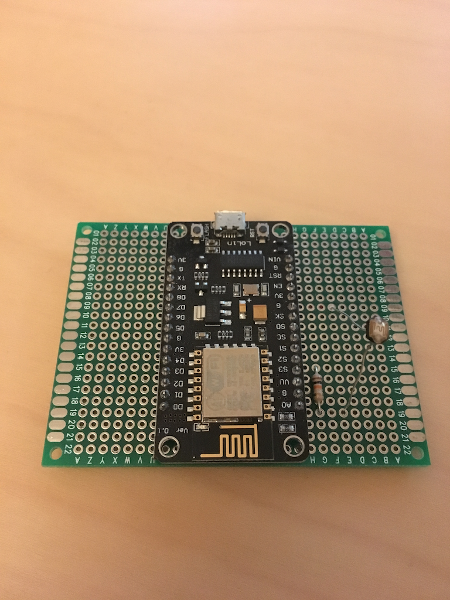

# hercules
MQTT+Node.js based hub for home automation

Current status: Test-running it in my flat. There are motion detectors in every room (except the bathroom). All the light bulbs got replaced with Phillips Hue ones. Plus, there's one light sensor (LDR) in one of the rooms.
A central Raspberry Pi running hercules retrieves all the sensor data and decides when to turn on or off which light. 


## Setup
Note that this reflects **my** current setup. Yours may differ in various ways. Choose your hardware wisely.


### Central server
There is one central server, running the MQTT broker **[Mosquitto](https://mosquitto.org/)** and hercules.

Currently that's a Raspberry Pi 2 Model B connected via Gigabit Ethernet. But you may use any other system to run hercules. Just remember that fast hardware with a good network connection will reduce the latency between input (e.g. Motion sensors detects motion) and output (e.g. Hue Lights turns on).

Use a Node.js version >=6.6.0 (this project uses some ES6 functionality which is not or only partially supported by lower releases of Node.js - confirmed to not work with at least 4.4.7).

### Motion Detectors
Find the corresponding project here: [github.com/RandomByte/mqtt-nodemotion](https://github.com/RandomByte/mqtt-nodemotion)


I'm using **HC-SR501 PIR** Motion Detectors. Citing from the [spec](https://www.mpja.com/download/31227sc.pdf) they run with 5V and have a range up to 7 meters. I have them set to *repeat trigger mode*, *full sensing distance* and *shortest delay*.

In my case each motion detector is connected to an [Onion Omega](https://onion.io/) which runs OpenWRT. The fact that they run Linux is actually the only reason why they are running Node.js for this job. Feel free to do this in C with the same or any other microcontroller as long as it can provide the necessary 5V and has some sort of connectivity.

### Light sensor
Find the corresponding project here: [github.com/RandomByte/esp8266-mqtt-light-sensor](https://github.com/RandomByte/esp8266-mqtt-light-sensor)



That's a simple ESP8266 (NodeMCU) with an LDR soldered to it.

## Installation
1. Clone repo
2. Do `npm install --only=production`
3. Copy over `config.example.json` to `config.json` and change it as needed
4. Run with `node index.js`

Steps for deamonized autorun will follow when it gets more stable.

## Debugging
Run with `DEBUG=hercules:* node index.js` to get verbose logging. Make sure to run `npm install` (without the production flag) to install the debug module.

## Contributing
- Use [ESLint](http://eslint.org/) and make sure to install all development dependencies using `npm install` (without the production flag)

## Architecture
hercules can handle multple sites which each multiple rooms. Sensors can be on site level (like a light sensor) or on room level (like motion detectors).


````
Site 1..n Room
Room 1..n Sensor
Site 1..n Sensor

````

### MQTT Channel-structure
`Site -> Room -> Sensor` or `Site -> Sensor`

**Examples:**  
`/Home/Kitchen/Temperature`  
`/Work/Hallway/Motion`  
`/Home/Luminosity`

